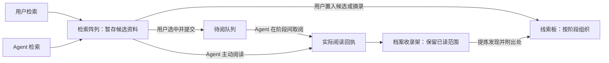

# 莱茵生命资料馆：三区域调查工作台方案

2026-09-12 初次梳理。下文保留完整协作流程的设计草案与当时现状。

后续进展：已先实现同一三维场景内的手动证据白板预览。视觉采用错落纸片、图钉与红绳；
阶段作为属性，不把白板切成分栏。支持自由拖动、编辑、手动关联和资料置入，按会话保存在浏览器。
Agent 阶段操作、检索暂存和按实际阅读归档的协议仍待接入。当前操作见 [资料馆说明](rhine-lab.md)。

## 目标与现状

让用户和 Agent 共用一个调查工作台：检索阵列保存发现的资料，档案收录架保存 Agent 实际阅读过的资料，线索板保存按任务阶段组织的发现、疑问和用户补充。

当前第三个自带皮肤是 `rhine-lab`，属于现有 DSH 插件。

| 区域或能力 | 当前实现 | 需要补齐 |
| --- | --- | --- |
| 检索阵列 | 已有三维阵列、Agent 检索操作、手动搜索、真实资料定位 | 独立的暂存资料集合；按搜索批次展示；区分用户与 Agent 检索 |
| 检索结果暂存 | 手动搜索保留当前结果；Agent 来源由会话记录恢复 | 新手动搜索会清空上一批结果，需要跨检索保留暂存资料 |
| 档案收录架 | 已有分页、翻阅、阅读器、已读范围和引用标记 | 目前搜索命中和手动收藏也直接入架，应按实际 Agent 阅读回执入架 |
| 用户补充资料 | 已有摘录、版本与行号，并可随问题发送 | 缺少逐份资料的待阅请求、处理进度和失败反馈 |
| 线索板 | 已有摘录篮、调查记录和最终报告 | 缺少持久的任务、阶段、线索卡和双方编辑协议 |
| 性能基础 | 已有共享表现、实例裁剪、分帧准备、模型复用及固定画质 | 新业务应复用这些机制，避免资料数量直接变成实体模型数量 |

核心问题是资料集合的语义。目前 `workbench.ts:607` 将 Agent 所有来源和用户收藏合并后传入档案架，`workbench.ts:349` 又把手动结果与这些资料合并成阵列内容。两个区域共享了过多资料，尚未表达“未读 → 已读”的流转。未读资料也不等于用户已提交的待阅请求。

## 三区域的职责

### 1. 线索板

围绕一个调查任务组织阶段。每个阶段显示目标、状态、重要发现、未解问题和来源链接；阶段不固定为“检索／阅读／整理”，由任务需要决定。简单问题可以只用一个阶段。

线索卡支持 Agent 明确写入，也支持用户从阵列、阅读器或档案架置入资料摘录，或直接写一条笔记。用户置入尚未阅读的候选资料是允许的，应保留“用户补充／待核验”等标记，不因此改变 Agent 已读状态。

每张卡保留所属阶段、作者、修订号和来源。来源链接包含资料身份、版本与适用行号；没有来源的内容是笔记或假设，不能伪造引用。Agent 读过一份资料也不自动证明卡上的推论成立。

Agent 在开始大型任务时建立阶段，在获得关键材料或结束一个阶段时更新线索；使用明确的工具操作记录这些内容。不要从流式正文、思考内容或工具次数猜测阶段完成与关键发现。报告继续承担最终回答，线索板承担过程中可复查的工作记录。

### 2. 检索阵列

同时接收 Agent 与用户检索所得，显示每批检索的关键词、执行者、状态、命中标题、相关片段及来源。用户自己的搜索条件和选中文档独立保存，Agent 新结果到达时只更新相关列表和计数，不抢占用户正在看的结果、镜头或正文。

建议按“全部／Agent 检索／我的检索”筛选执行者，按“未读／已提交待阅／已收录”查看状态，并能查看单次搜索。`origin` 继续表示本地、云端或外部来源；另设执行者字段，不能用本地／云端区分谁发起搜索。

新搜索替换的是当前查询视图，不删除已有暂存记录。初次打开自动载入的目录是浏览入口，不算 Agent 搜索成果，也不自动生成待阅请求。资料按现有版本绑定身份合并；同一份资料在多次搜索中出现时保留多个批次关联，实际资料只存一份。

暂存按会话与任务管理，提供清理已结束批次的操作；队列中或线索板正在引用的资料不能随列表清理而丢失。历史批次、结果列表和正文按需分页，不把完整语料或无上限正文放入浏览器常驻状态。

用户可以打开原文、置入线索板、保留候选资料，或选择一份／多份资料“交给 Agent 阅读”。自行打开原文不会变成 Agent 已读，也不会自动发送给 Agent。

### 3. 档案收录架

只有收到可信的 Agent 阅读回执才收入档案架。复用现有 `agentRead`、`readRanges` 和阅读操作身份；不能仅凭引用状态 `cited`、检索命中、收藏或用户点击判定已读。

阅读过一部分即可入架，但必须标明实际范围，不能显示为全文已读。云端 inspect 返回的实际内容可按现有阅读回执收录，并标明“已读返回片段”；只有映射链接而没有返回正文时不算读过对应原文。用户发送的摘录也不冒充原文工具的阅读回执。

入架后，阵列默认未读集合移除该资料；历史搜索批次仍保留命中记录和“已收录”链接。线索卡引用同一个资料身份，不复制实体。重复阅读只更新范围，重复搜索不把已读资料降回未读；直接阅读取得的资料可以直接收录。已收录资料仍可有尚未完成的指定范围待阅请求，两者分别展示。

用户正在阅读某份资料时，即使它收到 Agent 阅读回执，也应保留当前正文节点、滚动位置和选择。动画完成与否不能决定是否归档；历史恢复不重播整场运输过程。

## “Agent 稍等会阅读”需要单独设计

现有 `lib/client.js:3104` 使用宿主 `session.prompt(..., 'queue', ...)`。同级 DSH 的公开契约与 inbox 实现分别把 `queue` 定义为追加下一轮、`steer` 定义为影响运行中的轮次；不能把现有排队按钮描述为当前大型任务中途自动读资料。

有两种可明确表达的行为：

| 行为 | 做法 | 适用范围 |
| --- | --- | --- |
| 当前回答结束后继续读 | 复用现有消息队列，附资料定位与阅读请求 | 实施较小，但会形成后续轮次 |
| 当前调查进行中稍后读 | 新增会话待阅集合，Agent 在阶段边界通过工具取得新增请求，再调用阅读工具 | 更符合协作调查，需要工具与持久化支持 |

建议把第二种作为目标。第一种可以作为早期可用版本，但 UI 要明确标注“当前回答结束后处理”。不要悄悄把已有提交切换为会干预当前执行的 `steer`。

待阅请求至少区分“已提交／处理中／已读／未处理／读取失败”，并保留所请求的版本、文档与范围。提交被接受不等于 Agent 已读；由实际读取覆盖确认完成。部分范围读完只能记录部分进度。Agent 决定暂不处理时保留原因，工具失败可以重试。

实现自动取阅需要 Agent 的任务指引配合，并可在合适的工具或阶段边界提醒有新增请求；单纯把记录写进前端列表，Agent 不会自行得知。空闲会话中提交时还需通过宿主启动处理轮次；只写待阅集合不会唤醒 Agent。用户搜索本身不启动新轮次。

## 状态与持久化建议

以“一份资料登记表 + 三种区域视图”组织，避免三套数组各自决定事实。

| 对象 | 主要职责 |
| --- | --- |
| Source | 版本绑定身份、定位、摘录与实际阅读范围；复用当前本地／云端身份合并 |
| SearchBatch | 发起者、查询条件、工具或请求 ID、状态、有序来源 ID |
| ReadRequest | 用户选择的来源与范围、处理状态、对应实际阅读记录 |
| Investigation | 跨轮次的任务 ID、目标、阶段顺序与状态 |
| ClueCard | 阶段 ID、内容类型、正文、来源引用、作者与修订号 |

现有 `InvestigationSnapshot.investigationId` 绑定当前轮次或待发送问题，不能直接当跨多轮的大型任务 ID。应另外建立任务身份，并明确关联哪些轮次；切换会话、任务和阶段都不能混淆归属。

优先复用 DSH 已有的会话事件与 `sessionProjections`：Agent 侧可以追加自定义 session 事件，客户端可以订阅 projection。用一个 reducer 处理 Agent 与用户的阶段、线索卡、检索批次和待阅变更，可随会话日志恢复，也避免再建一套独立数据库。

同级宿主源码已确认公开注入 `sessions` 和 `sessionProjections`：`ctx.sessions.get(sessionId)` 可取得已加载会话并调用 `session.append(type, data)`；投影支持注册、`stateOf` 和 `snapshot`。当前插件宿主尚未接入这些服务，手动 UI 到共享状态的写入仍需实现，并验证会话归属、事件与 schema 持久化、重载及目标发布版宿主兼容。首版可先支持当前已打开会话；未加载会话虽可经 `sessionController.resolveAgent()` 恢复，但会激活 Agent，不能为后台展示无条件恢复所有会话。

建议新增插件自己的事件和 projection，而不直接借用宿主 todos：同级宿主的 todo 示例在 `turn/start` 清空，不符合跨轮调查的需要。现有 `src/evidence-state.js` 的 WeakMap 只服务运行时读取去重，也不适合作为工作台持久存储。

Agent 工具和用户操作应提交按稳定 ID 修改的操作，带作者与修订依据；避免整板快照覆盖。冲突时保留用户的新编辑并返回明确冲突；重放同一操作须幂等。完整原文不复制进板卡或每轮上下文，只保存定位和必要摘录。

现有 `lib/client.js:3054` 的快照签名会重建调查快照再序列化。新板卡与待阅状态应使用独立增量订阅，避免把更多状态塞进每次聊天更新时的全量历史扫描和字符串化；是否同时重构原扫描路径应单独测量后决定。

当前手动收藏与摘录在浏览器 `prts-rhine-desk:v1:<sessionId>` 下。迁移时保留它们：尚无 Agent 阅读证据的收藏转为保留在阵列的资料，用户摘录保留原来源与内容。不能把旧收藏统一升级为 Agent 已读，也不能因语料升级自动指向新版同名文档。

## 布局与性能边界

第一版建议左侧是可收展的线索板，中央保留检索阵列，右侧沿用档案收录架；三个区域有清楚的入口与计数。阵列和档案架继续使用当前同一三维场景和镜头切换。展开完整线索板时使用文字卡片工作区，窄屏按区域切换。第三个三维空间和独立镜头可以在交互稳定后单独设计。

线索板先用普通 DOM 卡片，不增加常驻的 WebGL 场景、物理模拟或每张卡独立的纹理。DOM 卡片按事件局部刷新，不挂到三维每帧循环里；关闭或被完全遮住的三维区域可沿用现有暂停能力。

继续沿用每页 12 份架上实体、最多 2 个同时活动模型、有限动画队列、分帧准备和模型池。结果到达先更新数据与可读列表，三维表现按需准备。大量命中不产生同样数量的模型或无上限运输动画。

还需调整 `scene.ts` 的到达动画规则：当前新增来源本身就能入队飞往架上，仅修改文字或过滤 DOM 不够；搜索结果应留在阵列，实际阅读回执才触发入架。沿用现有逐次 `operations` 身份处理并发、快速完成与重复读取。

当前工作区的优化源文件比部分历史说明更新，已有阵列小部件 LOD、架上内构准备等接入。本方案不评估它们是否已进入正在运行的构建，也不根据旧文档断言当前还没有这些优化。功能工作尽量集中在业务状态、宿主桥接和 UI 层，保持 `ui/rhine/original/` 的材质、光学、LOD 与裁剪工作独立推进。

功能改动可能减少未读命中造成的架上模型准备，但不能据此宣称整体性能提升。实施后需要用相同场景、结果批次和测量方式比较；本次仅静态审查，没有运行浏览器性能测试。

## 建议实施顺序与验收

1. **先拆资料状态和区域投影。** 累计保存多批检索，区分目录与搜索；阵列保存未读候选，架上只放实际已读资料，同时修正动画与旧收藏迁移。
2. **接入待阅协作。** 验证宿主会话事件、projection 和用户写入通路，加入资料选择、提交、处理状态与 Agent 阶段取阅；先做一条从提交到真实读回执的完整流程。
3. **加入阶段线索板。** 复用已验证的持久化协议，支持 Agent 阶段操作和用户置入，处理跨轮任务、幂等与编辑冲突，再打磨拖放等操作。
4. **最后扩展三维表现并做性能回归。** 在功能稳定后决定是否给线索板增加实体空间，避免同时改变状态语义和底层渲染。

应验收的关键场景：

- Agent 搜到十份只读两份：默认阵列中未读资料八份，档案架两份，原搜索批次仍可查十份；八份未读资料不自动成为用户已提交的待阅请求。
- 用户连续搜索两次：第一批暂存资料仍在；Agent 并发搜索不替换用户当前查询。
- 用户自己打开、收藏、摘录或置入线索板：都不增加 Agent 已读数量。
- 可确定映射到同一版本文档的云端命中、本地阅读和再次引用：保留同一身份；云端独立正文与本地行号空间不同的内容不强行合并，跨版本同名资料不误合并。
- 用户提交某段待阅范围：入队不提前显示已读，部分阅读不提前完成整个请求。
- 直接阅读、快速读完、并发读和失败重试：资料状态按回执更新，不依赖动画时机。
- 阶段中的用户新线索与 Agent 更新并发：不丢内容，不发生旧快照整板覆盖。
- 刷新、加载历史、切会话和跨轮继续任务：恢复所属任务与状态，不重放旧动画。
- 旧手动收藏和摘录完整保留；版本失效时保留来源与已知片段。
- 大批资料抵达及板卡更新期间：阅读位置保持，实体数有上限，隐藏暂停和退出释放仍有效。

## 主要代码入口

| 入口 | 本次观察 |
| --- | --- |
| `ui/rhine/types.ts` | 已有来源、已读标记、阅读范围、当前轮快照；缺少任务阶段、板卡与待阅协议 |
| `ui/rhine/catalogue.ts` | 已有版本绑定来源合并与每页 12 槽配置，可作为公共资料身份基础 |
| `ui/rhine/workbench.ts:349`、`:607`、`:763` | 阵列合并、档案架合并与手动搜索的主要分拆点 |
| `ui/rhine/workbench.ts:427`、`:974` | 手动数据本地保存、摘录和问题提交 |
| `ui/rhine/scene.ts:343`、`:434` | 新资料运输与真实阅读操作调度，需要共同调整 |
| `lib/client.js:2706`、`:3104` | 持久工具回执投影、宿主消息队列桥接 |
| `src/archive-presentation.js` | 本地／云端搜索和实际返回内容的展示回执 |
| `src/index.js`、`src/ui.js` | 新 Agent 工具、会话状态接口的候选入口 |

以上行号用于定位当前审查版本，后续源码编辑可能移动。
